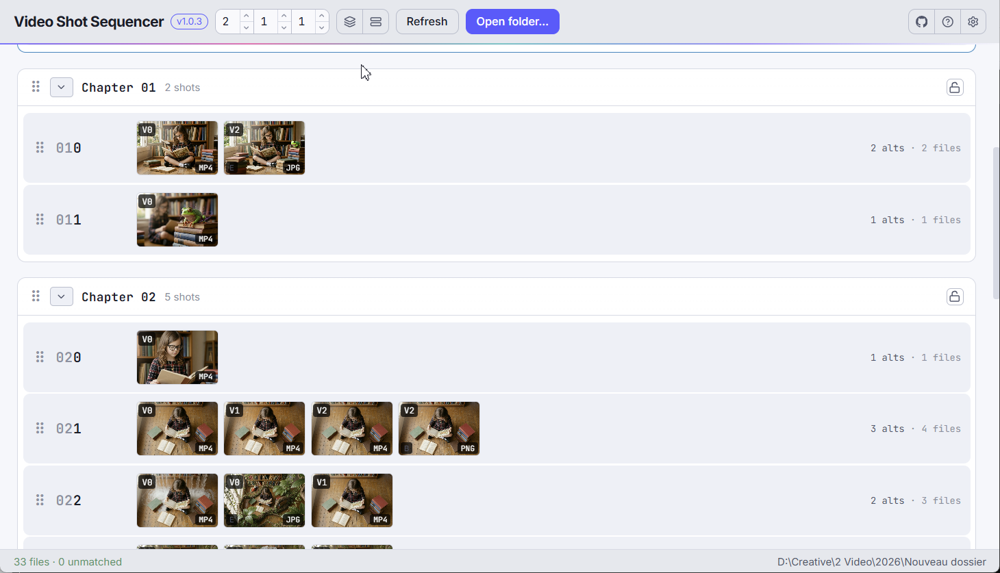

<p align="center">
  
</p>

<h1 align="center">Video Shot Sequencer</h1>

<div align="center">
  <strong>Drag the shots. The files renumber themselves.</strong><br>
  Bulk renumber your numbered working files on disk, in one safe two-phase pass.
</div>

<br>

<!-- readme:nav -->

<div align="center">
  <a href="../../releases/latest"></a>
  <a href="../../releases"></a>
</div>

<h3 align="center">
  <a href="https://apps.yaiol.com/en/p/video-shot-sequencer/">Website</a>
  <span>&nbsp;·&nbsp;</span>
  <a href="#install">Install</a>
  <span>&nbsp;·&nbsp;</span>
  <a href="#what-it-is">Features</a>
  <span>&nbsp;·&nbsp;</span>
  <a href="#documentation">Documentation</a>
  <span>&nbsp;·&nbsp;</span>
  <a href="#build-from-source">Development</a>
</h3>

<div align="center">
  <sub><a href="https://apps.yaiol.com/en/p/video-shot-sequencer/help/"><b>Help in 28 languages</b></a></sub>
</div>

<!-- /readme:nav -->

---

<p align="center">
  
</p>

---

## Install

| Windows | macOS | Linux |
|:---:|:---:|:---:|
| [](../../releases/latest) | [](../../releases/latest) | [](../../releases/latest) |
| x64 installer | Intel and Apple Silicon | portable AppImage |

> **Windows note:** SmartScreen may warn on first launch because the app is not code-signed. Click "More info", then "Run anyway".

---

## What it is

When you build a video project (a DaVinci Resolve timeline, for example) from numbered working files, reordering a sequence means renaming a pile of files by hand and working out new numbers without collisions. Video Shot Sequencer does that for you: it reads a folder, groups the files into shots, lets you drag the shots into the order you want, and rewrites every affected filename on disk in one safe pass.

The folder on disk is always the source of truth - the app is a helper, not the leader. You can rename or add files in Explorer and re-scan to pull the changes back in.

---

## Features

- **Drag to renumber** - drag shot rows into the order you want and the app rewrites every affected filename on disk, no manual renaming.
- **Commit when you're ready** - reordering builds up a batch you review and apply (or discard) all at once; renames run in one safe pass so files swapping numbers can never collide.
- **Paired files stay together** - group the files in a shot that share a version (a clip and its still) so a drag moves the whole set and never splits the pair.
- **Lock what's finished** - lock a chapter and no drag, drop, or renumber can touch it, so a stray move elsewhere can't disturb an edit you've settled.
- **Works alongside Explorer** - rename or add files in Explorer, then re-scan to pull the changes in.

---

## Documentation

| | |
|---|---|
| **User manual** | [Read it online](https://apps.yaiol.com/en/p/video-shot-sequencer/help/) |
| **Printable PDF** | attached to each [release](../../releases/latest) |
| **What's new** | [Release notes](https://apps.yaiol.com/en/p/video-shot-sequencer/help/releases/) |
| **Product page** | [apps.yaiol.com](https://apps.yaiol.com/en/p/video-shot-sequencer/) |

---

## Build from source

```bash
npm install
npm run electron:dev   # React + Electron together (dev)
```

Requires Node.js 20+.

```bash
npm run dist        # Windows x64 installer
npm run dist:mac    # macOS DMG
npm run dist:linux  # Linux AppImage
```

---

## Architecture

An Electron app: a React renderer (built with Vite) over an Electron main process that runs a small local Express server for folder scanning, file streaming, and batch renames. There is no database - the folder on disk is the entire state, and per-folder configuration lives in a `vss.ini` file beside the media.

| Layer | Technology |
|-------|-----------|
| UI framework | React 19 |
| Desktop shell | Electron |
| Local API | Express 5 |
| Build tool | Vite |
| Packaging | Electron Builder |

<details>
<summary><b>The naming convention</b></summary>

The app understands files named `CCSVExtra.ext`:

- `CC` - chapter digits (2 by default, configurable)
- `S` - slot digit within the chapter (1 by default)
- `V` - version digit within the slot (1 by default)
- `Extra` - a free-form per-file suffix
- `.ext` - file extension (`.mp4`, `.jpg`, ...)

With the defaults, `0001.mp4` is chapter `00`, slot `0`, version `1`; `0020E.jpg` is chapter `00`, slot `2`, version `0`, extra `E`. The digit widths are stored per folder in `vss.ini`.

</details>

<details>
<summary><b>The data model</b></summary>

- **Shot** = `(chapter, slot)` - the unit of sequencing.
- **File** belongs to one shot, distinguished within it by version + extra + extension.
- **Chapter** groups shots for display and sets the scope of a renumber.

The app reads a folder, groups files by shot, shows each shot as a row with a thumbnail strip of its files, and lets you drag shots to reorder. Reordering renumbers the shots and renames the underlying files.

</details>

<details>
<summary><b>Lock vs. gap-preservation, and the two-phase rename</b></summary>

Two orthogonal concerns govern how shots renumber:

- **Lock** (per chapter) controls *whether* a chapter can change. A locked chapter rejects every operation that would touch it - no drops in or out, no internal reorder, no chapter-reorder of itself.
- **Gap-preservation** (project-wide) controls *how* slot numbers are assigned when something does change. With it on (the default), manual gaps between slot numbers survive every operation; with it off, slots are consolidated to `0..N-1` on every drop.

Reordering never touches disk immediately - drags queue *pending* renames in the app. When you commit, the whole batch is applied in two phases: every file is first moved to a temporary name, then from the temporary name to its final one. This guarantees that two files swapping numbers can never collide mid-rename.

</details>

---

## License

Released under the [MIT License](LICENSE).

<div align="center">
  <sub>Video Shot Sequencer is part of <a href="https://apps.yaiol.com">yaiol Applications</a>.</sub>
</div>
